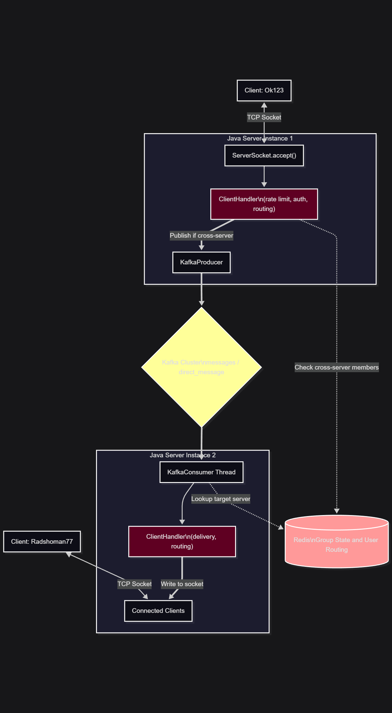

# Java Distributed Chat Server

A production-aware, distributed chat server built in Java. Started as a university group project for CS313 — System Concurrency, independently expanded into a distributed system using Kafka, Redis, and PostgreSQL.

---

## Architecture

```
+--------+     TCP      +------------------+     Kafka      +------------------+
| Client | <----------> |    Server A      | <-----------> |    Server B      |
+--------+              | Port 8080        |               | Port 8081        |
                        +------------------+               +------------------+
                                |                                   |
                         ClientHandler                       ClientHandler
                         (rate limiting)                    (rate limiting)
                                |                                   |
                         SafeGroupChat                       SafeGroupChat
                         (BlockingQueue)                     (BlockingQueue)
                                |                                   |
                        +-------+-------+               +-----------+
                        |               |               |
                   PostgreSQL        Redis           Kafka
                  (auth/users)  (group state)   (cross-server msgs)
```

**Same-server message flow:**
```
User types → ClientHandler → rate limit check → BlockingQueue → dispatcher → members
```

**Cross-server message flow:**
```
User types → ClientHandler → Kafka "messages" topic → other server's consumer → members
```

---

## What Was Built

### Original University Project
- TCP socket server, one thread per client
- Group chat with `ReentrantLock` for thread safety
- `SafeGroupChat` / `UnsafeGroupChat` to demonstrate race conditions
- Message history, file transfer, video streaming

### Independent Expansion

#### Phase 1 — Thread Pool
Raw thread per client doesn't scale — each costs ~1MB of stack memory and the OS has to schedule all of them.

Replaced with a fixed `ExecutorService` pool of 200 threads. Threads are reused across client connections. Chat servers are I/O-bound so 200 threads is a defensible starting point — threads spend most time blocked on `socket.read()`, not computing.

#### Phase 2 — BlockingQueue per Group
Original: sender's thread looped through all members and wrote to each socket directly. One slow client blocked the sender entirely.

Fixed: each `SafeGroupChat` owns a `LinkedBlockingQueue` and a dedicated dispatcher thread. Sender drops the message and returns immediately. Dispatcher handles delivery asynchronously.

#### Phase 3 — Rate Limiting + Graceful Shutdown
- Rate limiting: max 5 messages per 10 seconds per user, tracked with a counter and window timestamp
- Graceful shutdown: JVM shutdown hook drains the thread pool (`shutdown()` + `awaitTermination()`) before the process dies

#### Phase 4 — Authentication + PostgreSQL
- BCrypt password hashing — passwords never stored plain text
- SQLite → PostgreSQL migration to support concurrent connections from multiple server instances
- Login and registration flow over TCP before joining the chat

#### Phase 5 — Kafka (Distributed Messaging)
Problem: two server instances can't share the same `groupChats` map. Client A on Server 1 and Client B on Server 2 are invisible to each other.

Solution: each server publishes messages to a Kafka `messages` topic. Each server subscribes and delivers to its local clients. A `SERVER_ID` (UUID) is embedded in every message to prevent a server from re-delivering its own messages.

Cross-server delivery only fires when Redis confirms there are members from other servers in the group — no unnecessary Kafka traffic for same-server groups.

#### Phase 6 — Redis (Shared Group State)
Problem: group membership lived only in each server's local memory. Clients couldn't join groups created on other servers.

Solution: Redis stores group metadata centrally.
- `group:{name}:serverid` — which server owns the group
- `group:{name}:members` — set of `username:serverID` pairs
- `dm:{userA}:{userB}` — DM conversation existence (usernames sorted alphabetically for consistency)

Group creators and joiners are registered in Redis. On disconnect, members are removed automatically.

#### Phase 7 — Direct Messages
- Same-server DMs: direct socket delivery, no Kafka needed
- Cross-server DMs: published to Kafka `direct_message` topic, delivered to the receiver's server

---

## Commands

| Command | Description |
|---|---|
| `!help` | Show all commands |
| `!quit` | Disconnect |
| `!status` | Show all users' statuses |
| `!status <text>` | Set your status |
| `!friend <username>` | Send a friend request |
| `!friends` | List friends |
| `!create <groupName>` | Create a group and auto-join |
| `!join <groupName>` | Join a group (replays history) |
| `!leave` | Leave current group |
| `!gm <groupName> <message>` | Send to group without joining |
| `!dm <username> <message>` | Send a private message |
| `!sendfile <username>` | Send a file |
| `!stream <username>` | Stream video |

---

## Requirements

- Java 17+
- PostgreSQL
- Redis
- Apache Kafka 4.x (KRaft mode)

---

## How to Run

**Start infrastructure:**
```bash
# Kafka (Windows)
.\bin\windows\kafka-server-start.bat .\config\server.properties

# Redis (WSL/Linux)
redis-server
```

**Create Kafka topics:**
```powershell
.\bin\windows\kafka-topics.bat --create --topic messages --bootstrap-server localhost:9092 --partitions 1 --replication-factor 1
.\bin\windows\kafka-topics.bat --create --topic direct_message --bootstrap-server localhost:9092 --partitions 1 --replication-factor 1
```

**Start servers (multiple instances):**
```bash
java -jar server.jar 8080
java -jar server.jar 8081
```

**Start client:**
```bash
java -jar client.jar
# Enter server IP and port when prompted
```

---

## Config Files (not committed)

- `src/main/resources/db.properties` — PostgreSQL connection
- `src/main/resources/producer.properties` — Kafka producer
- `src/main/resources/consumer.properties` — Kafka consumer
- `src/main/resources/redis.properties` — Redis connection

---

## Contributors

**Original university project:**
Mohamed Sharif, Mohammad Rayyan, Russell Hall, Ghassan Shalayel, John Holland, Ethan Holland

**Distributed systems expansion (Phases 4–7):**
Mohammad Rayyan

## Architectural decisions and implementation details documented in `docs/` folder.

